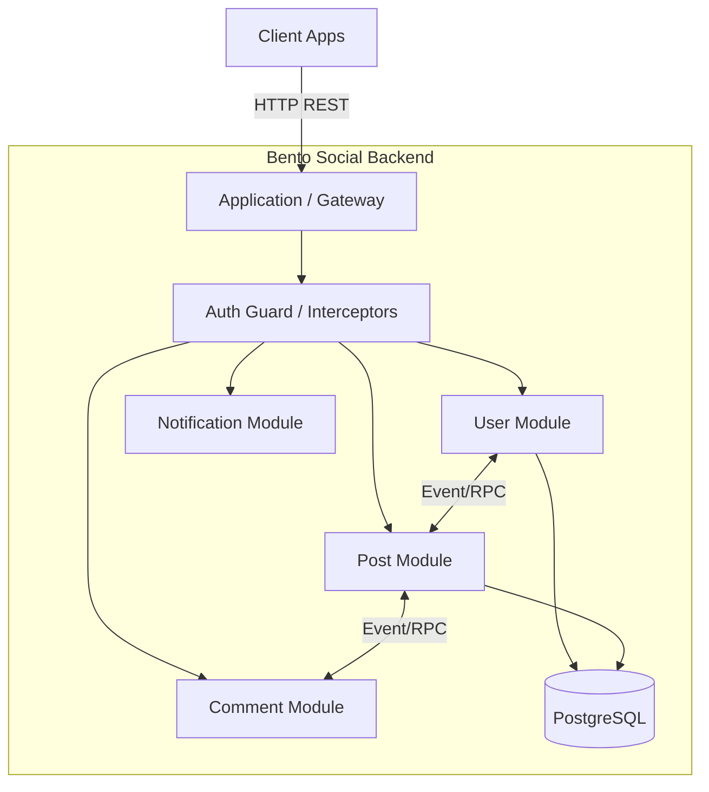

# Kiến Trúc High-Level - Bento Social Backend (Monolith)

Tài liệu này mô tả kiến trúc của dự án `bento-social-be`. Dự án được xây dựng dưới dạng **Modular Monolith** sử dụng **NestJS**, áp dụng các nguyên lý của **Hexagonal Architecture** (Ports & Adapters) để đảm bảo tính tách biệt, dễ kiểm thử và khả năng mở rộng (hoặc tách thành microservices sau này).

---

## 1. Tổng Quan Công Nghệ

| Thành phần         | Công nghệ / Thư viện | Mục đích                                                         |
| :----------------- | :------------------- | :--------------------------------------------------------------- |
| **Framework**      | **NestJS**           | Framework chính quản lý IoC, Modules, Decoration.                |
| **Ngôn ngữ**       | **TypeScript**       | Static typing, tăng tính an toàn và minh bạch.                   |
| **Database**       | **PostgreSQL**       | Cơ sở dữ liệu quan hệ chính.                                     |
| **ORM**            | **Prisma**           | Mapping dữ liệu object-relational, migration, type-safe queries. |
| **Communication**  | **HTTP / RPC**       | Giao tiếp Client-Server và Internal Services.                    |
| **Infrastructure** | **Redis**            | Caching, Rate limiting (thông qua component share).              |
| **Packaging**      | **Docker**           | Containerization cho deployment.                                 |

---

## 2. Kiến Trúc Tổng Thể (System Architecture)

Dự án tuân theo mô hình **Modular Monolith**. Mặc dù toàn bộ code nằm trong một repo và chạy trên một process (hoặc cụm process giống nhau), nhưng logic nghiệp vụ được chia tách rõ ràng thành các **Modules** độc lập về mặt logic.



### Các Layer Chính:

1.  **Presentation Layer (Controllers)**: Tiếp nhận request từ Client (REST) hoặc từ module khác (RPC).
2.  **Application Layer (Se của dự án `bento-social)**: Chứa logic nghiệp vụ (Business Logic), điều phối các thao tác.
3.  **Domain Layer**: Chứa các Model, Interface (Ports) định nghĩa nghiệp vụ cốt lõi.
4.  **Infrastructure Layer (Adapters)**: Implements các Interface để tương tác với DB (Prisma), External API, v.v.

---

## 3. Kiến Trúc Chi Tiết Bên Trong Module (Hexagonal Architecture)

Mỗi module (ví dụ: `UserModule`, `PostModule`) được thiết kế tuân theo **Hexagonal Architecture** (Ports & Adapters) để giảm sự phụ thuộc trực tiếp vào implementation cụ thể.

### Cấu trúc một Module điển hình:

```text
src/modules/user/
├── user.port.ts             # [Ports] Interfaces cho Service và Repository (Input/Output Ports)
├── user.service.ts          # [Application] Implementation business logic (Use Cases)
├── user.model.ts            # [Domain] Entity/Model definitions
├── user.dto.ts              # [DTO] Data Transfer Objects
├── user-http.controller.ts  # [Adapter Primary] REST API & RPC Controller
├── user-prisma.repo.ts      # [Adapter Secondary] Implementation thao tác Database (Prisma)
├── user.di-token.ts         # [DI] Injection Tokens
└── user.module.ts           # [Configuration] Wiring các thành phần lại với nhau
```

### Giải thích các thành phần:

1.  **Ports (`*.port.ts`)**:

    - Định nghĩa **Input Port** (Vd: `IUserService`): Những gì module cung cấp ra bên ngoài hoặc cho Controller.
    - Định nghĩa **Output Port** (Vd: `IUserRepository`): Những gì module cần từ hạ tầng (Database, 3rd party).
    - _Lợi ích_: Giúp Service không phụ thuộc vào Prisma hay HTTP, dễ dàng Mock khi Unit Test.

2.  **Adapters**:

    - **Primary Adapter** (`*-http.controller.ts`): Nhận request HTTP chuyển đổi thành call đến Service. Controller hỗ trợ cả endpoints cho Client (`/v1/...`) và endpoints RPC (`/rpc/...`) cho internal comms.
    - **Secondary Adapter** (`*-prisma.repo.ts`): Implement `IUserRepository`, sử dụng Prisma Client để thao tác DB.

3.  **Dependency Injection (DI)**:
    - Sử dụng **Custom Providers** với `InjectionToken` (trong `di-token.ts`) để bind Interface với Implementation.
    - Ví dụ trong `user.module.ts`:
      ```typescript
      { provide: USER_REPOSITORY, useClass: UserPrismaRepository }
      { provide: USER_SERVICE, useClass: UserService }
      ```
    - Controller sẽ inject `IUserService` thông qua token `USER_SERVICE` thay vì class cụ thể `UserService`.

---

## 4. Các Design Patterns Chính

### 4.1. Dependency Injection (DI) & Inversion of Control (IoC)

NestJS Core cung cấp DI container mạnh mẽ. Dự án tận dụng tối đa việc bind qua Token thay vì Class cụ thể, giúp linh hoạt thay thế implementation (ví dụ: đổi từ Prisma sang TypeORM hay Mock Repo) mà không sửa code Service/Controller.

### 4.2. Repository Pattern

Mọi truy cập dữ liệu đều thông qua Repository Interface. Service không bao giờ gọi trực tiếp Prisma Client.

- **Interface**: `find(id)`, `create(data)`, `delete(id)`...
- **Implementation**: `PrismaRepository` thực thi các lệnh này.

### 4.3. Domain Events

Dự án sử dụng cơ chế Event để giảm sự phụ thuộc chặt chẽ (coupling) giữa các module khi thực hiện các tác vụ phụ (side effects).

- Ví dụ: Khi `Post` được tạo -> Publish `PostCreatedEvent`.
- Module `Notification` hoặc `User` (stats) lắng nghe event này để xử lý mà `PostService` không cần gọi trực tiếp.
- Vị trí: `src/share/event`.

### 4.4. RPC Style Internal Communication

Thay vì gọi hàm trực tiếp giữa các module (Direct Valid method call) - điều thường thấy trong Monolith, dự án xây dựng sẵn cấu trúc **RPC Controller** (`UserRpcHttpController`).

- Điều này cho thấy **sự chuẩn bị sẵn sàng cho Microservices**: Các module giao tiếp qua giao thức mạng (HTTP abuse giả lập RPC) ngay cả khi đang chạy chung process. Khi tách Service, chỉ cần đổi cấu hình mạng là xong.

---

## 5. Shared Kernel (`src/share`)

Thư mục `src/share` đóng vai trò là thư viện chung (Shared Library) cho tất cả module:

- **Components**: Các wrapper kỹ thuật (Jwt, Redis, Prisma Service).
- **Guards**: Authorization (RemoteAuthGuard, RolesGuard).
- **Interfaces**: Các kiểu dữ liệu chung (Requester, TokenPayload).
- **Utils**: Các hàm tiện ích (Paging, Error handling).
- **Events**: Định nghĩa event structure.

---

## 6. Luồng Dữ Liệu (Data Flow)

Một request điển hình (ví dụ: Client lấy thông tin User) sẽ đi như sau:

1.  **Client** gửi `GET /v1/users/:id`.
2.  **UserHttpController** (Adapter Primary):
    - Nhận request.
    - Gọi `IUserService.getProfile(id)`.
3.  **UserService** (Application):
    - Thực hiện business logic (nếu có).
    - Gọi `IUserRepository.get(id)`.
4.  **UserPrismaRepository** (Adapter Secondary):
    - Dùng Prisma Client query xuống PostgreSQL.
    - Trả về Entity `User`.
5.  **Controller** trả response về Client (thông qua DTO mapping để ẩn field nhạy cảm).
